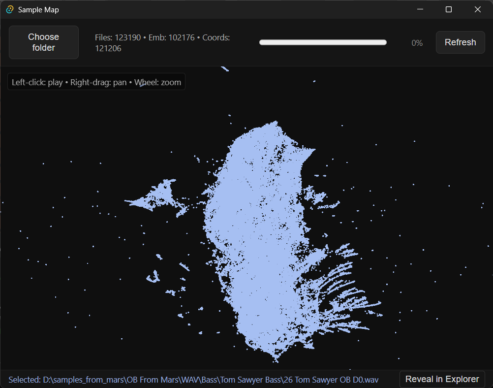

# Synth Map

Zoomable point‑cloud browser for WAV samples: scans a folder, embeds with CLAP (HTS‑AT), maps with UMAP, and renders a WebGL scatter; click any dot to instantly audition, copy its path, and reveal in Explorer.

Run (dev): `npx tauri dev`

Status: MVP is playable and mapping works; indexing/embedding pipeline and large‑set performance are under active iteration.

License: MIT.
